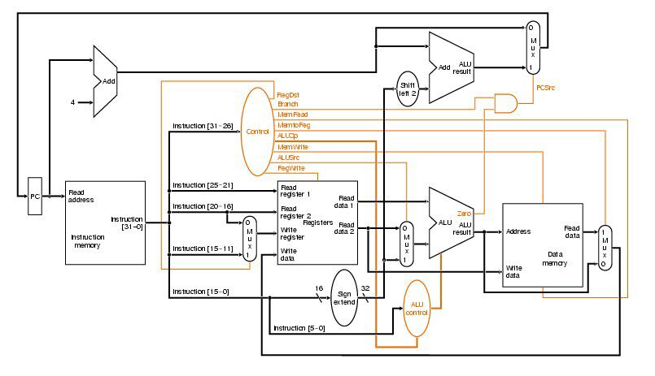

HITwh NSCSCC Team | 哈尔滨工业大学（威海）全国大学生计算机系统能力培养大赛小组

# 2-浅析计组课设中制作的CPU

大家是否还记得这一张图：

这是一个典型的单周期MIPS CPU架构：

1. PC生成下一个指令的地址；
2. 译码模块译码，CU通过译码模块翻译出来的操作码控制寄存器堆（Register File）的相应读写；
3. CU将控制信号传给ALU控制器，然后ALU控制器控制ALU进行相应的运算；
4. 最后ALU的结果需要写回给寄存器堆或者内存，CU仍然需要发出控制信号控制RegFile等器件的行为。

## 单周期处理器设计步骤

1. 分析指令系统，得出数据通路；
2. 为数据通路选择合适的器件；
3. 连接组件建立数据通路；
4. 分析每条指令的实现，确定控制信号；
5. 集成控制信号，形成完整的控制逻辑。