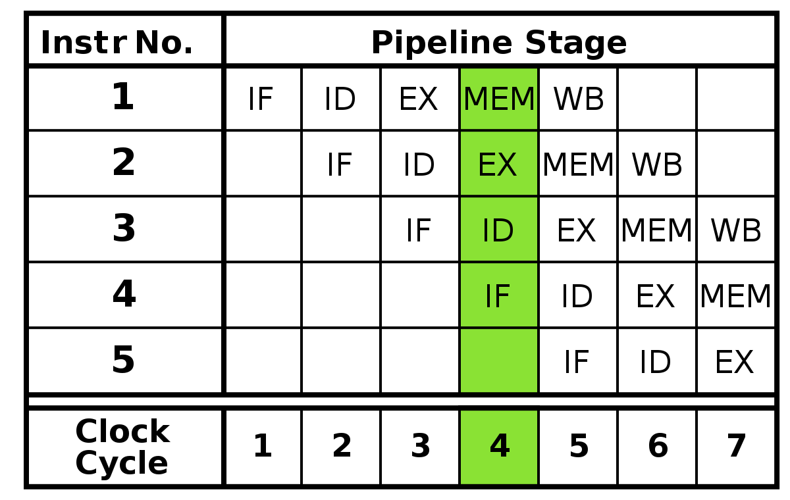

HITwh NSCSCC Team | 哈尔滨工业大学（威海）全国大学生计算机系统能力培养大赛小组

[TOC]

# 3-什么是五级流水、数据前推、流水线暂停

请看图：

## 五级流水线的五个阶段

1. Instruction Fetch - IF：取指阶段；
2. Instruction Decode - ID：译码阶段；
3. Execute - EX：执行阶段；
4. Memory Access - MEM：访存阶段；
5. Writeback - WB：写回阶段。

## 用比喻详解五级流水、数据前推、流水线暂停

工厂有五个工人，他们是A B C D E，他们每个人都只负责自己的工作：

1. A负责的工作名称叫”取指“；
2. B负责的工作名称叫“译码”；
3. C负责的工作名称叫“执行”；
4. D负责的工作名称叫“访存”；
5. E负责的工作名称叫“写回”；

他们每个工人都不去管别人的工作是什么样子的；

工厂有个时钟喇叭，以每秒一次的频率大声“嘀嘀嘀”，当时钟喇叭发出声音的时候：

1. 传送带向前移动一个工人的位置；
2. ABCDE同时开始做自己的工作；

现在你是一个未加工产品，你被送上了传送带。

### 五级流水横向来看

1. 你听到了一声洪亮的“嘀”声，你被传送带往前送了一格到达了A工人，他在下一个“嘀”来临之前把你“取指”了；
2. 你又听到了一声“嘀”，你被传送带往前送到了B工人，他在下一个“嘀”来临之前把你“译码”了；
3. 以此类推，最后，E工人完成了对你的“写回”，下一个“嘀”来临的时候，你变成了一个成熟的自己！

### 五级流水纵向来看

1. 你是工人C，你只负责把产品“执行”；
2. 第一个声音发出，传送带向前推进一格，但是此时传送带在你这儿的位置上并没有东西；
3. 第二个声音发出，传送带向前推进一格，你看到B正在对一个东西“译码”，但是此时传送带在你这儿的位置上仍然没有东西；
4. 第三个声音发出，传送带向前推进一格，你传送带有东西了！你在下一个声音到来之前对这个东西完成了“执行”工序；
5. 第四个声音发出，传送带向前推进一格，你处理的东西到了D那儿，但是你现在又拿到了从B那儿送过来的东西，你又开始加工；
6. 第五个声音发出、第六个声音发出……声音源源不断地发出，一个一个没有被加工的东西到了你这儿，你在下一个声音发出之前完成了对它们的加工……
7. 第n个声音发出，你在下一个声音发出之前完成了“执行工序，第n+1个声音发出，没有东西再来了，你的东西送到了D那儿；
8. 第n+2个声音发出，这个东西送到了E那儿；
9. 最后一个声音发出，这个东西从E那儿被送出去。你们五个人完成了所有产品的加工！

### 五级流水整体来看

1. 在第一个声音发出的时候，整个工厂只有A在做工序；
2. 到了第4个声音发出的时候，整个工厂已经有4个人在同时工作了！其中

   - A在对第四个产品进行工序，这个产品刚刚来到A这儿；

   - B在对第三个产品进行工序，这个产品已经被A处理完了，现在在B这儿等待处理；

   - C在对第二个产品进行工序，这个产品已经被A B都处理完了，现在在C这儿；

   - D在对第一个产品进行工序，这个产品已经被A B C都处理了！现在在D这儿。
3. 放眼望去，整个工厂里面每个人都在有条不紊的做自己的工作！

> 动态流程可以查看项目中的PPT部分，里面有动画帮助理解

### 流水线暂停

想象你还是工人C，你负责”执行“工序，但是现在出现了一个大问题：

- 这个东西太复杂了！你在下一个声音发出之前根本做不完！
- 你不能把你没做完的东西让传送带送给D加工！这个产品不合格！

这可怎么办呢？

于是，你大喊一声：做不完了，sad！包工头听见了你的喊声，急忙把传送带关掉了！

此时：

1. 下一个声音发出的时候，传送带不会向前推进一格了；
2. 下一个声音发出的时候，你仍然在努力解决当前的工序问题；
3. 下一个声音发出的时候，虽然其他四个工人都做好了自己的工作，但是因为传送带没有动，所以他们手里都还留着上一个声音发出的时候正在处理的东西；
4. 几个声音过去了，你还在努力解决当前问题，大家急切的眼神让你充满了决心；
5. 第32个声音过去了，你终于解决了这个问题！你大喊一声：我完事了，happy！包工头长舒一口气，开启了传送带；
6. 第33个声音到来了，传送带向前推进了一格，D开始处理从你这儿传送过去的东西，你开始处理从B那儿传送过来的东西，一切都是这样和谐；
7. 第n个声音到来的时候，你发现又是一个难题！这时你又大喊一声：做不完了！
8. 包工头暂停了流水线，大家开始看你表演长达32个周期的”执行“工序……

### 数据前推

想象你还是工人C，你负责”执行“工序，你们的工厂生产很多东西，甚至能直接把生产出来的东西拿来自己使用！但是现在又出现了一个大问题：

- 你现在正在处理一个螺丝刀，下一个声音发出了，传送带把螺丝刀送给了D继续加工，但是B突然非常激动地给你说，这个产品很特殊，他需要一个螺丝刀才能完成对现在这个产品的工序，不然下一个声音到来的时候，这个东西到你这儿就不是一个合格的产品！
- 你也非常激动，但是虽然在你加工过后，螺丝刀直接能用了，而且D E工人只对这个螺丝刀包装一下对外出售，但是你至少也得等到E工人最后包装完成过后，B工人才能拿到螺丝刀啊！这样一来，这个产品就一直被错误地加工下去，最后甚至会影响到整个流水线的产品质量！除非流水线暂停！

但是聪明的你突然想到了办法，于是悄悄对B说：

**”我把螺丝刀加工完后直接分你一个，你保持低调，不要声张！“**

于是：

1. 你和B达成了协议，暗中交易；而且你可以光速克隆一个一模一样的螺丝刀，除了你和B，谁都不知道！
2. 在第一个声音发出的时候，B悄悄给你说：”我需要螺丝刀！“
3. 下一个声音发出之前，你在对螺丝刀完成工序的同时光速克隆了一个一模一样的螺丝刀，然后给了B；B在下一个声音发出之前用你赞助的螺丝刀完成了工序，这使你充满了决心！
4. 下一个声音发出来了！你们两个若无其事地继续进行着各自的工作；
5. 第n个声音发出来了，B又突然悄悄给你说：”我需要螺丝刀！“
6. 你们两个又开始了交易……
