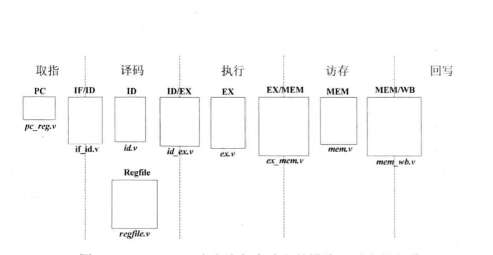

HITwh NSCSCC Team | 哈尔滨工业大学（威海）全国大学生计算机系统能力培养大赛小组

[TOC]

# 4-一个静态五级流水MIPS的最基本架构

## 流水线寄存器

流水线寄存器在五级流水架构图中，视觉上位于每个阶段的交界处，用来锁存此阶段得出的结果，并在下一个阶段到来的时候将此结果送给下一个模块进行处理；

### 用处

因为所有部件都是连接在一起的，如果没有流水线寄存器的话，一个时钟信号到来之后，IF阶段处理的结果马上反馈到了ID阶段，同时如果ID在这个周期内得出了结果，就会马上反馈到EX阶段，以此类推；如果一个周期时间非常长的话，一条指令将在一个周期内得出结果，于是本质上这个变成了单周期处理器，就不存在流水线这一个说法了。

## 取指阶段

- PC模块：给出指令地址，其中实现指令指针寄存器PC，该寄存器的值就是指令地址；
- IF/ID模块：实现取指与译码阶段之间的流水线寄存器，将取指阶段的结果在下一个时钟上升沿传递到译码阶段。

## 译码阶段

- ID模块：对指令进行译码，译码结果包括运算类型、运算所需的源操作数、要写入的目的寄存器地址等等；
- RegFile模块：实现了32个32位通用整数寄存器，可以同时进行两个寄存器的读操作和一个寄存器的写操作；
- ID/EX模块：实现译码与执行阶段的流水线寄存器，将译码阶段的结果在下一个时钟周期传递到执行阶段。

## 执行阶段

- EX模块：根据译码阶段的结果进行指定的运算，给出运算结果；
- EX/MEM模块：执行阶段与访存阶段的流水线寄存器，将执行阶段的结果在下一个时钟周期传递到访存阶段。

## 访存阶段

- 在本讲义中留空，感兴趣的同学自行学习；

## 写回阶段

- 在本讲义中留空，感兴趣的同学自行学习；

## 一个独立的模块

有一个CTRL模块，用于控制流水线暂停以及清空，不便于归入流水线中的某一个阶段。