HITwh NSCSCC Team | 哈尔滨工业大学（威海）全国大学生计算机系统能力培养大赛小组

[TOC]

# 5-第一条指令 ORI 的实现

此章节会完全参考 《自己动手写CPU》中 OpenMIPS 处理器的实现方法给大家讲解 ORI 的实现，但是又在内容上有所优化。

从此节开始到结束，**将是本讲义的重点部分**，前面所有部分可以说是一种铺垫，希望大家通过后面部分的学习能够掌握讲义所提供给大家的一个思维方式来解决实验中遇到的难题。

当然这个讲义提供的是一种最基本的思维方式，为的是让大家能够更好的理解各个指令五级流水的实现，其他更有效更快速的思维方式大家可以在课余时间自行学习。

## 前言

摘自《自己动手写CPU》

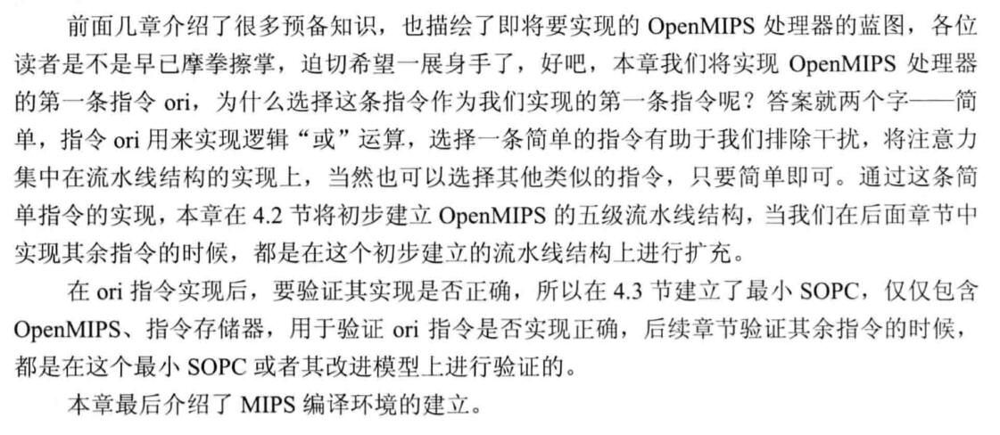

## 补充内容：MIPS指令集格式

在MIPS架构中，指令被分为三种类型：R型、I型和J型。三种类型的指令的最高6位均为6位的opcode码。从25位往下，

- R型指令用连续三个5位二进制码来表示三个寄存器的地址，然后用一个5位二进制码来表示移位的位数（如果未使用移位操作，则全为0），最后为6位的function码（它与opcode码共同决定R型指令的具体操作方式）；

- **I型指令则用连续两个5位二进制码来表示两个寄存器的地址，然后是一个16位二进制码来表示的一个立即数二进制码；**

- J型指令用26位二进制码来表示跳转目标的指令地址（实际的指令地址应为32位，其中最低两位为00，高四位由PC当前地址决定）。

三种类型的指令图示如下：

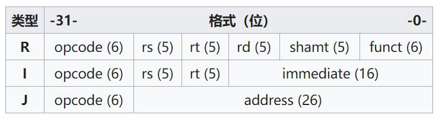

参考资料：[MIPS架构——维基百科](https://zh.wikipedia.org/w/index.php?title=MIPS%E6%9E%B6%E6%A7%8B&wteswitched=1#MIPS%E6%8C%87%E4%BB%A4%E6%A0%BC%E5%BC%8F)


## ORI 指令说明


### 16位立即数扩展

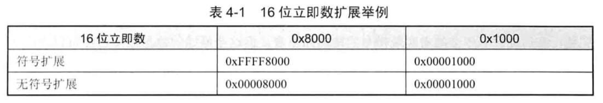

- 符号扩展：按照最高位扩展；
- 无符号扩展：将扩展后的32位数据的高16位全置为0；

# 原始的数据流图

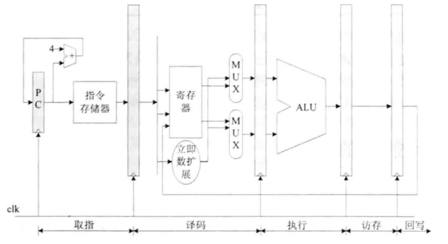

- IF：取出指令存储器中的指令，与此同时PC值递增得到下一条指令的地址，准备取下一条指令；
- ID：对指令进行译码，根据译码结果从RegFile中取出源操作数，其中ORI还需要立即数扩展；
- EX：根据译码阶段送入的源操作数、操作码进行运算。对于ORI指令而言，就是进行逻辑“或”运算，运算结果传递到访存阶段；
- MEM：对于ORI指令，访存阶段没有任何操作，直接把结果传递到下一个阶段；
- WB：把运算结果保存到目的寄存器。

## OpenMIPS 五级流水线结构图


# 取指阶段的实现

取指阶段取出指令存储器中的指令，同时PC值递增。准备下一条指令；

包括PC和IF/ID两个模块

## PC模块

PC模块的作用是给出指令地址，接口如图所示：

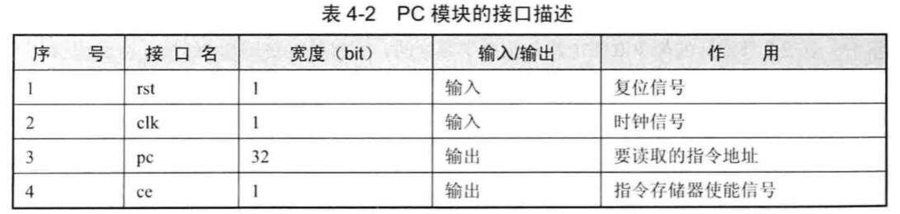

PC代码讲解：

```verilog
`include "defines.v"

module pc_reg(

	input wire                  clk,
	input wire              	rst,
	
	output reg[`InstAddrBus]    pc,
	output reg                  ce
	
);

    // 指令存储器禁用的时候 PC值需要归零
	always @ (posedge clk) begin
		if (ce == `ChipDisable) begin
			pc <= 32'h00000000;
		end else begin
	 		pc <= pc + 4'h4;
		end
	end
	
    // 复位的时候需要禁用指令存储器
	always @ (posedge clk) begin
		if (rst == `RstEnable) begin
			ce <= `ChipDisable;
		end else begin
			ce <= `ChipEnable;
		end
	end

endmodule
```

## IF/ID模块

IF/ID模块的作用是暂时保存取指阶段所得的指令，以及对应的指令地址，并在下一个CLK传递到译码阶段，接口如图所示：

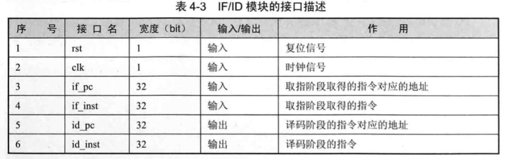

（5、6：传递给译码阶段的……）

```verilog
module if_id(

	input	wire				  clk,
	input wire					  rst,
	

    input wire[`InstAddrBus]	  if_pc,
	input wire[`InstBus]          if_inst,
	output reg[`InstAddrBus]      id_pc,
	output reg[`InstBus]          id_inst  
	
);

    // 如果复位的话，传递给下一个阶段的数据要清零
	always @ (posedge clk) begin
		if (rst == `RstEnable) begin
			id_pc <= `ZeroWord;
			id_inst <= `ZeroWord;
	  	end else begin
            id_pc <= if_pc;
            id_inst <= if_inst;
		end
	end

endmodule
```

# 译码阶段的实现

此时，我们的ORI指令已经进入了译码阶段，在这个阶段，CPU需要对这个指令进行译码，即给出需要进行的运算类型、参与运算的操作数。

## RegFile模块

这是寄存器堆模块，实现了32个32位通用寄存器，可以同时进行两个寄存器的读操作和一个寄存器的写操作。接口如图：

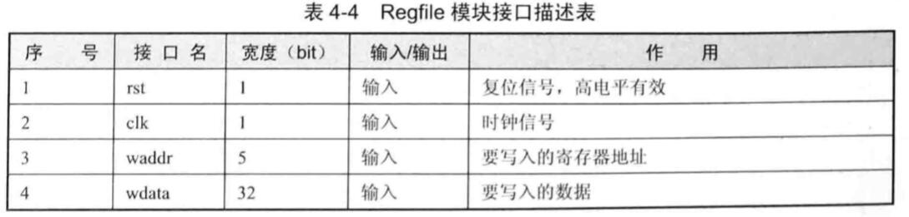

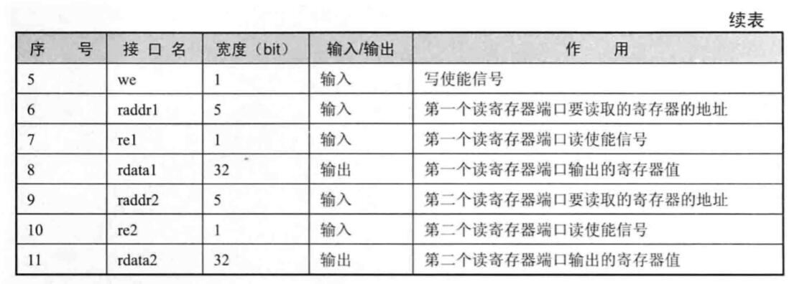

代码如下：

```verilog
`include "defines.v"

module regfile(

	input	wire				 clk,
	input wire					 rst,
	
	// 写端口
	input wire					 we,
    input wire[`RegAddrBus]		 waddr,
    input wire[`RegBus]			 wdata,
	
	// 读端口 1
	input wire					 re1,
    input wire[`RegAddrBus]		 raddr1,
    output reg[`RegBus]          rdata1,
	
	// 读端口 2
	input wire					 re2,
    input wire[`RegAddrBus]		 raddr2,
    output reg[`RegBus]          rdata2
	
);

    // 定义32个32位寄存器
	reg[`RegBus]  regs[0:`RegNum-1];

    // 写操作
	always @ (posedge clk) begin
		if (rst == `RstDisable) begin
            // 如果 写使能 而且 我们没有向0号寄存器写入东西的时候，我们才向寄存器里面写入
            // 因为 0 号寄存器只读而且永远读出 32'h0
			if((we == `WriteEnable) && (waddr != `RegNumLog2'h0)) begin
				regs[waddr] <= wdata;
			end
		end
	end
	
    // 读端口1 的读操作
	always @ (*) begin
       // 如果重置则读出 32'h0
	  if(rst == `RstEnable) begin
          rdata1 <= `ZeroWord;
       // 如果读0号寄存器，也只读出0
	  end else if(raddr1 == `RegNumLog2'h0) begin
          rdata1 <= `ZeroWord;
       // 当读地址与写地址相同，且写使能，且端口1读使能，则要把写入的数据直接读出来
       //   数据前推的实现，后面会提及
	  end else if((raddr1 == waddr) && (we == `WriteEnable) 
                  && (re1 == `ReadEnable)) begin // 注意此部分！理解！
	  	  rdata1 <= wdata;
       // 否则读取相应寄存器单元
	  end else if(re1 == `ReadEnable) begin
	      rdata1 <= regs[raddr1];
       // 如果第一个读端口不能使用时，输出0
	  end else begin
	      rdata1 <= `ZeroWord;
	  end
	end

    // 读端口2 的读操作
    // 和读端口1 类似
	always @ (*) begin
		if(rst == `RstEnable) begin
            rdata2 <= `ZeroWord;
	  end else if(raddr2 == `RegNumLog2'h0) begin
	  		rdata2 <= `ZeroWord;
	  end else if((raddr2 == waddr) && (we == `WriteEnable) 
                  && (re2 == `ReadEnable)) begin // 注意此部分！理解！
	  	  rdata2 <= wdata;
	  end else if(re2 == `ReadEnable) begin
	      rdata2 <= regs[raddr2];
	  end else begin
	      rdata2 <= `ZeroWord;
	  end
	end

endmodule
```

有一点需要注意：读寄存器是组合逻辑电路

```
always @ (*) 
```

因为一旦输入的要读取的寄存器地址发生了变化，必须要立刻给出新地址对应的寄存器的值，这样可以保证在译码阶段读取得到要读取的寄存器的值；**但是写操作是时序逻辑电路**，写操作发生在时钟信号的上升沿。

```
always @ (posedge clk) 
```

## ID模块

ID模块进行译码，得到最终运算的类型、子类型、源操作数等等，接口如图：

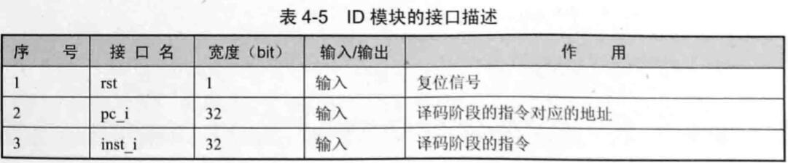

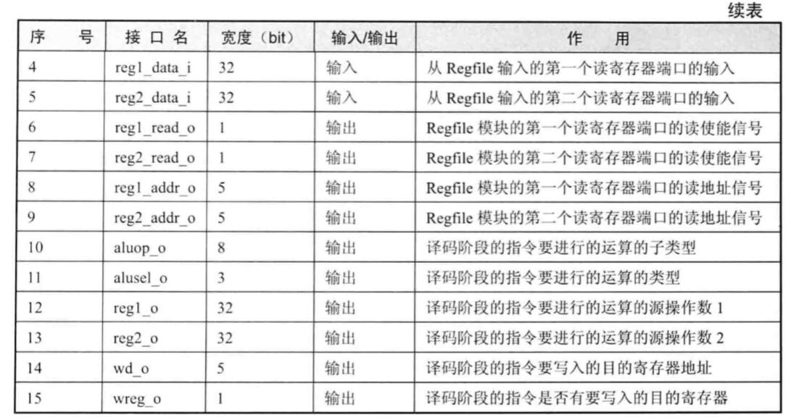

代码如下：

```verilog
`include "defines.v"

module id(

	input wire					  rst,
    input wire[`InstAddrBus]	  pc_i,
	input wire[`InstBus]          inst_i,

    // 读取的REGFILE的值
	input wire[`RegBus]           reg1_data_i,
	input wire[`RegBus]           reg2_data_i,

	// 输出到REGFILE的信息，包括读端口1和2的读使能信号以及读地址信号
	output reg                    reg1_read_o,
	output reg                    reg2_read_o,     
	output reg[`RegAddrBus]       reg1_addr_o,
	output reg[`RegAddrBus]       reg2_addr_o, 	      
	
	// 送到EX阶段的信息
    output reg[`AluOpBus]         aluop_o,  // ALU操作码
    output reg[`AluSelBus]        alusel_o, // ALU子操作码
    output reg[`RegBus]           reg1_o,   // 源操作数 1
    output reg[`RegBus]           reg2_o,   // 源操作数 2
    output reg[`RegAddrBus]       wd_o,     // 要写入的寄存器的地址
	output reg                    wreg_o    // 写使能信号
);

    // 取得指令的指令码、功能码等；
  wire[5:0] op = inst_i[31:26]; //对于ORI指令只需要判断 26-31bit 的值即可判断
  wire[4:0] op2 = inst_i[10:6];
  wire[5:0] op3 = inst_i[5:0];
  wire[4:0] op4 = inst_i[20:16];
    // 保存指令执行需要的立即数
  reg[`RegBus]	imm;
    // 指令是否有效
  reg instvalid;
  
 
    // 译码阶段，组合逻辑
    //   如果重置则进行以下操作
	always @ (*) begin	
		if (rst == `RstEnable) begin
			aluop_o <= `EXE_NOP_OP;
			alusel_o <= `EXE_RES_NOP;
			wd_o <= `NOPRegAddr;
			wreg_o <= `WriteDisable;
			instvalid <= `InstValid;
			reg1_read_o <= 1'b0;
			reg2_read_o <= 1'b0;
			reg1_addr_o <= `NOPRegAddr;
			reg2_addr_o <= `NOPRegAddr;
			imm <= 32'h0;
     // 如果不重置则进行以下操作
	  end else begin
          // 这里其实是default里面的值
          //   我们先看下面的case
			aluop_o <= `EXE_NOP_OP;
			alusel_o <= `EXE_RES_NOP;
			wd_o <= inst_i[15:11];
			wreg_o <= `WriteDisable;
			instvalid <= `InstInvalid;	   
			reg1_read_o <= 1'b0;
			reg2_read_o <= 1'b0;
			reg1_addr_o <= inst_i[25:21];
			reg2_addr_o <= inst_i[20:16];		
			imm <= `ZeroWord;			
		  case (op)
		  	`EXE_ORI:			
            begin
		  		wreg_o <= `WriteEnable; // 写使能
                aluop_o <= `EXE_OR_OP;
		  		alusel_o <= `EXE_RES_LOGIC; 
                reg1_read_o <= 1'b1;	// 读 rs
                reg2_read_o <= 1'b0;	// 不读 rt  	
                imm <= {16'h0, inst_i[15:0]};	// 立即数无符号扩展	
                wd_o <= inst_i[20:16];  // 写寄存器地址位 rt
				instvalid <= `InstValid;	
		  	end 							 
		    default:
                // 在上面已经给出
            begin
		    end
		  endcase
		end
	end
	

    // 确定运算的操作数1
	always @ (*) begin
        if(rst == `RstEnable) begin
			reg1_o <= `ZeroWord;
        end else if(reg1_read_o == 1'b1) begin
            reg1_o <= reg1_data_i;
            // 若没有 读使能，则把立即数作为数据输出为 操作数1
        end else if(reg1_read_o == 1'b0) begin
            reg1_o <= imm;
        end else begin
            reg1_o <= `ZeroWord;
        end
    end
	
    // 确定运算的操作数2
	always @ (*) begin
		if(rst == `RstEnable) begin
			reg2_o <= `ZeroWord;
        end else if(reg2_read_o == 1'b1) begin
            reg2_o <= reg2_data_i;
            // 若没有 读使能，则把立即数作为数据输出为 操作数1
        end else if(reg2_read_o == 1'b0) begin
            reg2_o <= imm;
        end else begin
            reg2_o <= `ZeroWord;
        end
    end

endmodule
```

## ID/EX模块

ID模块的输出连接到ID/EX模块，后者将译码阶段取得的运算类型、源操作数、要写的目的寄存器地址等结果，在下一个时钟传递到执行阶段，接口如图所示：

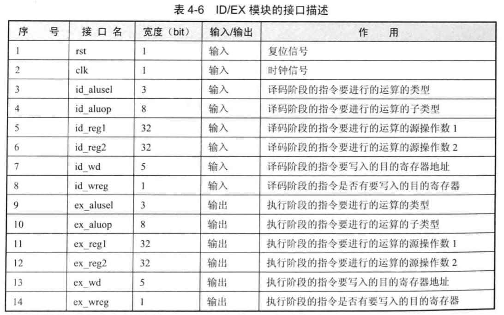

代码如下：

```verilog
`include "defines.v"

module id_ex(

	input	wire				  clk,
	input wire					  rst,

	
	// 从ID阶段传递过来的信息
	input wire[`AluOpBus]         id_aluop,
	input wire[`AluSelBus]        id_alusel,
	input wire[`RegBus]           id_reg1,
	input wire[`RegBus]           id_reg2,
	input wire[`RegAddrBus]       id_wd,
	input wire                    id_wreg,	
	
	// 需要传递到EX阶段的信息
	output reg[`AluOpBus]         ex_aluop,
	output reg[`AluSelBus]        ex_alusel,
	output reg[`RegBus]           ex_reg1,
	output reg[`RegBus]           ex_reg2,
	output reg[`RegAddrBus]       ex_wd,
	output reg                    ex_wreg
	
);

    // 如果重置的话，进行以下操作清空信息
	always @ (posedge clk) begin
		if (rst == `RstEnable) begin
			ex_aluop <= `EXE_NOP_OP;
			ex_alusel <= `EXE_RES_NOP;
			ex_reg1 <= `ZeroWord;
			ex_reg2 <= `ZeroWord;
			ex_wd <= `NOPRegAddr;
			ex_wreg <= `WriteDisable;
            // 如果不重置的话，把ID阶段的结果送到EX阶段
		end else begin		
			ex_aluop <= id_aluop;
			ex_alusel <= id_alusel;
			ex_reg1 <= id_reg1;
			ex_reg2 <= id_reg2;
			ex_wd <= id_wd;
			ex_wreg <= id_wreg;		
		end
	end
	
endmodule
```

# 执行阶段的实现

现在，指令已经进入了执行阶段了，在这个阶段，CPU将根据译码结果对源操作数等进行指定的运算并给出结果。

## EX模块

EX模块接收ID阶段翻译的信号来决定如何进行操作，接口如图所示：

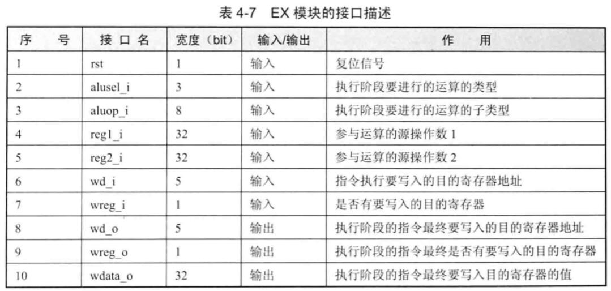

代码如下：

```verilog
`include "defines.v"

module ex(

	input wire					  rst,
	
	// 从译码阶段送过来的信息
	input wire[`AluOpBus]         aluop_i,
	input wire[`AluSelBus]        alusel_i,
	input wire[`RegBus]           reg1_i,
	input wire[`RegBus]           reg2_i,
	input wire[`RegAddrBus]       wd_i,
	input wire                    wreg_i,

	// 执行的结果
	output reg[`RegAddrBus]       wd_o,
	output reg                    wreg_o,
    output reg[`RegBus]			  wdata_o
	
);

    // 保存逻辑运算的结果
	reg[`RegBus] logicout;
    
    // 组合逻辑：根据运算子类型进行运算，此处只有“或运算”
	always @ (*) begin
		if(rst == `RstEnable) begin
			logicout <= `ZeroWord;
		end else begin
			case (aluop_i)
				`EXE_OR_OP:	begin
					logicout <= reg1_i | reg2_i;
				end
				default: begin
					logicout <= `ZeroWord;
				end
			endcase
		end    //if
	end      //always


    // 组合逻辑: 根据主运算类型选择一个选择一个运算结果最为最终结果输出
 always @ (*) begin
     // 需要写入的寄存器的地址
	 wd_o <= wd_i;	 	 
     // 寄存器写使能
	 wreg_o <= wreg_i;
     // 根据主运算类型选择一个选择一个运算结果最为最终结果输出
	 case ( alusel_i ) 
	 	`EXE_RES_LOGIC: begin
	 		wdata_o <= logicout;
	 	end
	 	default: begin
	 		wdata_o <= `ZeroWord;
	 	end
	 endcase
 end	

endmodule
```

注意：EX模块中全是组合逻辑电路，因为他们需要实时拿出运算结果！

## EX/MEM模块

EX模块的输出连接到EX/MEM模块，后者的作用是将执行阶段的结果在下一个时钟周期传递到访存阶段，接口如图所示：

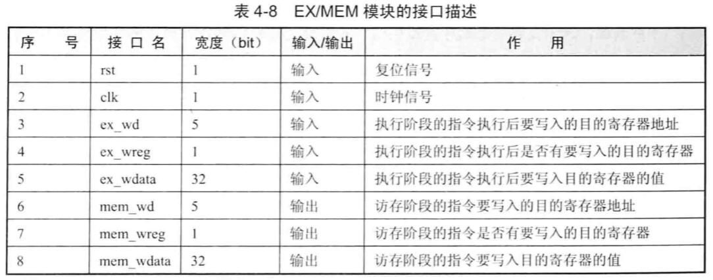

代码如下：

```verilog
`include "defines.v"

module ex_mem(

	input	wire				  clk,
	input wire					  rst,
	
	
	// 来自执行阶段的信息
	input wire[`RegAddrBus]       ex_wd,
	input wire                    ex_wreg,
    input wire[`RegBus]		      ex_wdata, 	
	
	// 送到访存阶段的信息
    output reg[`RegAddrBus]       mem_wd,
	output reg                    mem_wreg,
    output reg[`RegBus]			  mem_wdata
	
	
);


    // 时序逻辑
	always @ (posedge clk) begin
        // 如果重置的话，清除信息
		if(rst == `RstEnable) begin
			mem_wd <= `NOPRegAddr;
			mem_wreg <= `WriteDisable;
		    mem_wdata <= `ZeroWord;	
            // 不重置的话，把信息传递到MEM阶段
		end else begin
			mem_wd <= ex_wd;
			mem_wreg <= ex_wreg;
			mem_wdata <= ex_wdata;			
		end    //if
	end      //always
			

endmodule
```

# 访存阶段的实现

访存阶段，ORI指令不需要做任何事，所以只是简单地将执行阶段的结果传递给写回阶段即可。

## MEM模块

代码如下：

```verilog
`include "defines.v"

module mem(

	input wire					  rst,
	
	// 来自执行阶段的消息
	input wire[`RegAddrBus]       wd_i,
	input wire                    wreg_i,
    input wire[`RegBus]			  wdata_i,
	
	// 访存阶段的结果
    output reg[`RegAddrBus]       wd_o,
	output reg                    wreg_o,
    output reg[`RegBus]			  wdata_o
	
);

	// 如果重置则清除结果
	always @ (*) begin
		if(rst == `RstEnable) begin
			wd_o <= `NOPRegAddr;
			wreg_o <= `WriteDisable;
		  	wdata_o <= `ZeroWord;
            // 否则因为ORI在此阶段不需要做任何事情，所以直接送给下个阶段（WB）
		end else begin
		  	wd_o <= wd_i;
			wreg_o <= wreg_i;
			wdata_o <= wdata_i;
		end    //if
	end      //always
			

endmodule
```

## MEM/WB模块

代码如下：

```verilog
`include "defines.v"

module mem_wb(

	input	wire				  clk,
	input wire					  rst,
	

	// 来自访存阶段的信息
	input wire[`RegAddrBus]       mem_wd,
	input wire                    mem_wreg,
    input wire[`RegBus]			  mem_wdata,

	// 需要传递给写回阶段的信息
    output reg[`RegAddrBus]       wb_wd,
	output reg                    wb_wreg,
    output reg[`RegBus]			  wb_wdata	       
	
);


    // 如果重置的话，清除信息，否则传递给写回阶段
	always @ (posedge clk) begin
		if(rst == `RstEnable) begin
			wb_wd <= `NOPRegAddr;
			wb_wreg <= `WriteDisable;
		  	wb_wdata <= `ZeroWord;	
		end else begin
			wb_wd <= mem_wd;
			wb_wreg <= mem_wreg;
			wb_wdata <= mem_wdata;
		end    //if
	end      //always
			

endmodule
```

# 写回阶段的实现

经过上面的层层传递，ORI指令的运算结果已经到达了写回阶段了。

这个阶段实际上是在RegFile模块中实现的，请看这张图：


MEM/WB的输出直接连接到RegFile模块，此时会将指令的运算结果写入目的寄存器，具体代码参考“译码阶段的实现”

# 顶层模块的实现

顶层模块就是将上面实现的流水线各个阶段的模块进行实例化、连接，如图所示：


接口如图所示：

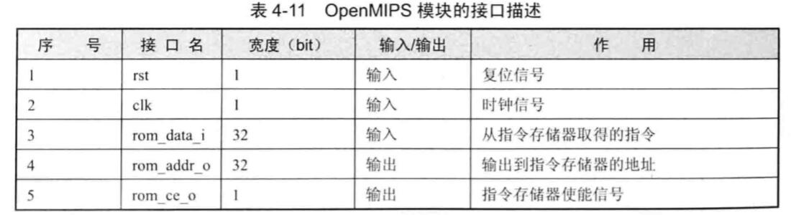

代码如下：

```verilog
`include "defines.v"

module openmips(

	input	wire				  clk,
	input wire					  rst,
	
 
	input wire[`RegBus]           rom_data_i,
    output wire[`RegBus]          rom_addr_o,
	output wire                   rom_ce_o
	
);

    // IF/ID模块的输出，连接到ID模块的输入
	wire[`InstAddrBus] pc;
	wire[`InstAddrBus] id_pc_i;
	wire[`InstBus] id_inst_i;
	
	// ID模块输出，连接到ID/EX模块的输入
	wire[`AluOpBus] id_aluop_o;
	wire[`AluSelBus] id_alusel_o;
	wire[`RegBus] id_reg1_o;
	wire[`RegBus] id_reg2_o;
	wire id_wreg_o;
	wire[`RegAddrBus] id_wd_o;
	
	// ID/EX模块输出，连接到EX模块的输入
	wire[`AluOpBus] ex_aluop_i;
	wire[`AluSelBus] ex_alusel_i;
	wire[`RegBus] ex_reg1_i;
	wire[`RegBus] ex_reg2_i;
	wire ex_wreg_i;
	wire[`RegAddrBus] ex_wd_i;
	
	// EX模块的输出，连接到EX/MEM模块的输入
	wire ex_wreg_o;
	wire[`RegAddrBus] ex_wd_o;
	wire[`RegBus] ex_wdata_o;

	// EX/MEM模块的输出，连接到MEM模块的输入
	wire mem_wreg_i;
	wire[`RegAddrBus] mem_wd_i;
	wire[`RegBus] mem_wdata_i;

	// MEM模块的输出，连接到MEM/WB模块的输入
	wire mem_wreg_o;
	wire[`RegAddrBus] mem_wd_o;
	wire[`RegBus] mem_wdata_o;
	
	// MEM/WB模块的输出，连接到WB模块的输入
	wire wb_wreg_i;
	wire[`RegAddrBus] wb_wd_i;
	wire[`RegBus] wb_wdata_i;
	
	// WB模块的输出，连接到ID阶段RegFile模块的输入
  wire reg1_read;
  wire reg2_read;
  wire[`RegBus] reg1_data;
  wire[`RegBus] reg2_data;
  wire[`RegAddrBus] reg1_addr;
  wire[`RegAddrBus] reg2_addr;
  
  // PC_REG 的实例化
	pc_reg pc_reg0(
		.clk(clk),
		.rst(rst),
		.pc(pc),
		.ce(rom_ce_o)	
			
	);
	
  assign rom_addr_o = pc;

  // IF/ID模块的实例化
	if_id if_id0(
		.clk(clk),
		.rst(rst),
		.if_pc(pc),
		.if_inst(rom_data_i),
		.id_pc(id_pc_i),
		.id_inst(id_inst_i)      	
	);
	
	// ID模块实例化
	id id0(
		.rst(rst),
		.pc_i(id_pc_i),
		.inst_i(id_inst_i),

		.reg1_data_i(reg1_data),
		.reg2_data_i(reg2_data),

		// 来自REGFILE的数据输入
		.reg1_read_o(reg1_read),
		.reg2_read_o(reg2_read), 	  

		.reg1_addr_o(reg1_addr),
		.reg2_addr_o(reg2_addr), 
	  
		// 送到ID/EX模块的数据
		.aluop_o(id_aluop_o),
		.alusel_o(id_alusel_o),
		.reg1_o(id_reg1_o),
		.reg2_o(id_reg2_o),
		.wd_o(id_wd_o),
		.wreg_o(id_wreg_o)
	);

  //ͨ RegFile模块的实例化
	regfile regfile1(
		.clk (clk),
		.rst (rst),
		.we	(wb_wreg_i),
		.waddr (wb_wd_i),
		.wdata (wb_wdata_i),
		.re1 (reg1_read),
		.raddr1 (reg1_addr),
		.rdata1 (reg1_data),
		.re2 (reg2_read),
		.raddr2 (reg2_addr),
		.rdata2 (reg2_data)
	);

	// ID/EX模块的实例化
	id_ex id_ex0(
		.clk(clk),
		.rst(rst),
		
		// 来自ID阶段的数据
		.id_aluop(id_aluop_o),
		.id_alusel(id_alusel_o),
		.id_reg1(id_reg1_o),
		.id_reg2(id_reg2_o),
		.id_wd(id_wd_o),
		.id_wreg(id_wreg_o),
	
		// 要送到EX阶段的数据
		.ex_aluop(ex_aluop_i),
		.ex_alusel(ex_alusel_i),
		.ex_reg1(ex_reg1_i),
		.ex_reg2(ex_reg2_i),
		.ex_wd(ex_wd_i),
		.ex_wreg(ex_wreg_i)
	);		
	
	// EX模块的实例化
	ex ex0(
		.rst(rst),
	
		// 来自ID/EX的数据
		.aluop_i(ex_aluop_i),
		.alusel_i(ex_alusel_i),
		.reg1_i(ex_reg1_i),
		.reg2_i(ex_reg2_i),
		.wd_i(ex_wd_i),
		.wreg_i(ex_wreg_i),
	  
	  // EX阶段的结果，输出到EX/MEM的数据
		.wd_o(ex_wd_o),
		.wreg_o(ex_wreg_o),
		.wdata_o(ex_wdata_o)
		
	);

  // EX/MEM的实例化
  ex_mem ex_mem0(
		.clk(clk),
		.rst(rst),
	  
		// 来自EX模块的数据	
		.ex_wd(ex_wd_o),
		.ex_wreg(ex_wreg_o),
		.ex_wdata(ex_wdata_o),
	

		// 将要送到MEM阶段的数据
		.mem_wd(mem_wd_i),
		.mem_wreg(mem_wreg_i),
		.mem_wdata(mem_wdata_i)

						       	
	);
	
  // MEM模块的实例化
	mem mem0(
		.rst(rst),
	
		// 来自EX/MEM模块的数据
		.wd_i(mem_wd_i),
		.wreg_i(mem_wreg_i),
		.wdata_i(mem_wdata_i),
	  
		// 要送到MEM/WB模块的数据
		.wd_o(mem_wd_o),
		.wreg_o(mem_wreg_o),
		.wdata_o(mem_wdata_o)
	);

  // MEM/WB 模块的实例化
	mem_wb mem_wb0(
		.clk(clk),
		.rst(rst),

		// 来自MEM的数据
		.mem_wd(mem_wd_o),
		.mem_wreg(mem_wreg_o),
		.mem_wdata(mem_wdata_o),
	
		// 将要送到RegFile的数据
		.wb_wd(wb_wd_i),
		.wb_wreg(wb_wreg_i),
		.wb_wdata(wb_wdata_i)
									       	
	);

endmodule
```

# 利用Vivado行为仿真

VIVADO行为仿真方法以及testbench编写本讲义不做讲解，请自行学习，但是在这儿提供一下思路：

1. 在testbench中创建一个顶层MIPS实例；
2. 给出时钟信号输入以及指令输入；
3. 在每个周期给出不同的测试指令（**不能有数据相关！因为至此我们还没有开始实现数据相关！**）；
4. 查看仿真波形，检查结果是否正确；

## 测试程序示例

这是一段测试程序，如图所示：

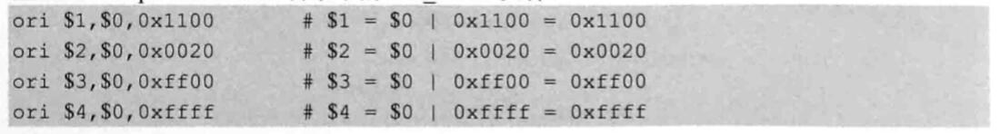

给出它的机器码：

```
34011100
34020020
3403ff00
3404ffff
```

为了使流水线情况更加直观，建议先一条指令一条指令查看仿真波形，熟悉之后最后再把四条指令全部发出查看结果是否正确。

# 回顾原始的数据流图


请以上面给出的一段测试程序为例，看看这四条指令在五级流水线中是如何流动的。