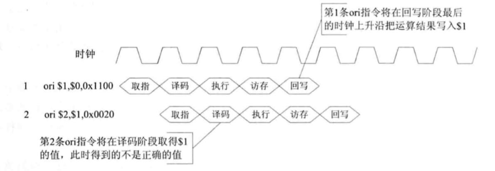

HITwh NSCSCC Team | 哈尔滨工业大学（威海）全国大学生计算机系统能力培养大赛小组

[TOC]

# 6-流水线数据相关问题

流水线中经常会有一些被称为“相关”的问题发生，它使得指令序列中下一条指令没有办法按照设计的时钟周期执行，这些“相关”会降低流水线的性能。

流水线中相关问题分为三种

1. 结构相关；
2. 数据相关；
3. 控制相关。

## 结构相关

指的是在指令的执行过程中，由于硬件资源满足不了指令执行的要求发生硬件资源冲突而产生的相关。

比如指令和数据都共享一个存储器，在某个时钟周期的时候：

- 流水线要完成某条指令中，对存储器中数据的访问操作；
- 流水线同时还要完成下一条指令的取指操作。

这样就发生了存储器访问冲突，产生了结构相关。

## 数据相关

**很常见的一种相关类型**，指的是流水线中在执行的几条指令里面，有一条或者多条指令依赖于前面指令的执行结果。

数据相关分为三种：

1. RAW：写后读数据，即后面的指令必须在前面的指令写之后读取数据，才能有正确结果；

   - 比如

     ```
     ORI $1, $0, 0x1100
     ORI $2, $1, 0x0020
     ```

     

     第一条ORI指令将写寄存器1，随后的第二条ORI指令需要读出寄存器1的数据，但是第一条指令还处于执行阶段，要在写回阶段才会把最新的值提交到RegFile，那么如果第二条ORI指令继续执行的话，就会得出错误的结果。

     就和之前在“3-什么是五级流水、数据前推、流水线暂停”中提到的一样，工人B需要用C加工的螺丝刀加工目前这个产品，但是这个螺丝刀只能在E加工完成后才能用得到，此时如果继续加工的话，B工人加工出来的产品将不是合格的。

2. WAR：读后写数据，即后面的指令必须在前面的指令读之后写入数据，才能有正确结果；

3. WAW：写后写数据，即后面的指令必须在前面的指令写之后写入数据，才能有正确结果；

