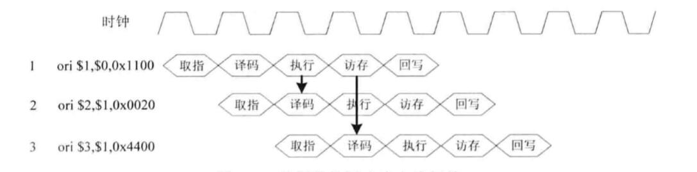

HITwh NSCSCC Team | 哈尔滨工业大学（威海）全国大学生计算机系统能力培养大赛小组

# 7-数据相关的解决办法介绍

对于数据相关，通常来说有三种解决方式：

1. 插入暂停周期（流水线暂停）；
2. 数据前推；
3. 编译器调度。

在这个讲义中我们只讲前两种方法。

## 流水线暂停

视觉上来说，在检测到流水线相关问题时，在流水线中插入一些暂停周期，效果如图所示：

### 实现原理

从字面上理解来说，就是将流水线暂停，等待上一条指令得出结果（或者解决冲突）过后，流水线才会继续流动。

如第3节提到的一样，一个工人大喊“做不完了！”，然后包工头将停止传送带的运行。

这之间有两个个细节：

- 工人向包工头发出信号请求流水线暂停
- 包工头收到信号后决定暂不暂停，并且如果暂停的话就发“停止”信号给传送带，让其停止运动

流水线暂停就是通过类似“请求暂停-开始暂停”的方式实现。具体实现之后会讲到。

### 额外

需要注意的是，流水线暂停不止可以解决相关问题。

在进行一个非常复杂的运算的时候（比如说OpenMIPS实现的除法在EX阶段需要32个时钟周期才能得出结果），它可以阻塞流水线的流动以确保结果正确。

虽然本质上还是解决的相关问题，但是流水线暂停还起着控制流水线流动的关键作用。

### 缺点

流水线暂停为流水线增加了很多空白周期，以至于每个器件不能最高效率发挥自己的能力，导致处理器性能下降。

但是值得注意的是，有的场合（比如和Load指令的数据相关）又必须请求流水线暂停，这些情况此讲义不做讲解。

## 数据前推

要避免流水线暂停导致的性能下降问题，我们就要寻求一个全新的解决方案。

大家回想一下第三节中所讲的内容就知道，视觉上来说，数据前推就如同“走后门”：

### 实现原理

数据前推将计算结果从其产生的地方直接送到其他指令需要的地方（甚至可以是所有功能单元处）以避免流水线暂停。

### 额外

需要注意的是，这个方法有一个前提：

- 新的寄存器值可以在执行阶段计算出来。

如果是加载指令，那么就**不满足**这个前提，因为：

- 加载指令在访存阶段才能获得最终结果。

这是一种load相关，需要进行流水线暂停。