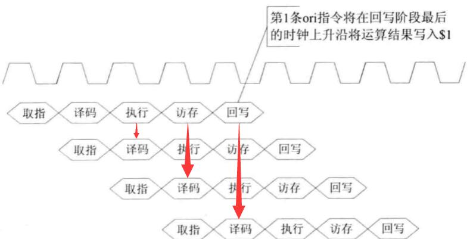
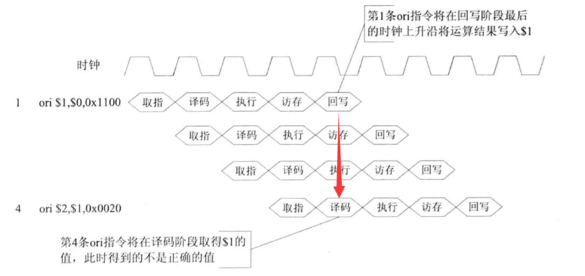
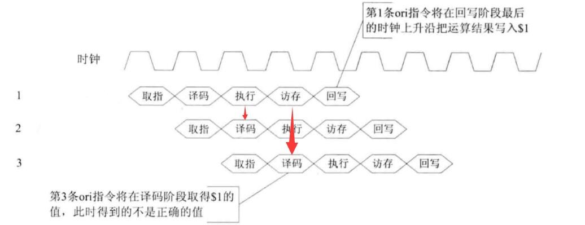
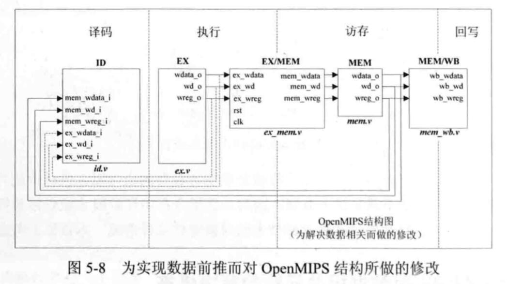
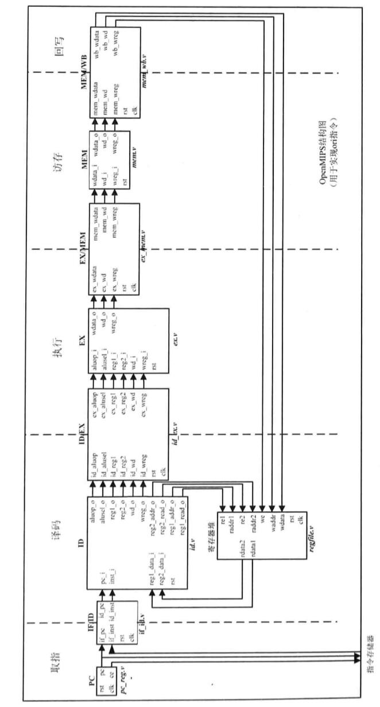

HITwh NSCSCC Team | 哈尔滨工业大学（威海）全国大学生计算机系统能力培养大赛小组

[TOC]

# 9-1-ORI 指令数据相关的解决办法 1 - 数据前推



在上一节我们说到，ORI指令也有三种数据相关的情况：

1. 相邻两条ORI指令数据相关；
2. 相隔一条ORI指令数据相关；
3. 相隔两条ORI指令数据相关。

我们再对比上面那张图看一下，其实它们也就是：

1. 位于后面的ORI指令在 ID 阶段请求读取，但是前面的ORI指令还处于 EX 阶段；
2. 位于后面的ORI指令在 ID 阶段请求读取，但是前面的ORI指令还处于 MEM 阶段；
3. 位于后面的ORI指令在 ID 阶段请求读取，但是前面的ORI指令还处于 WB 阶段（WB阶段的最后一个时钟上升沿才能把最新数值写入进RegFile）。

我们先看最简单的一种情况

## 相隔两条ORI指令数据相关

即位于后面的ORI指令在 ID 阶段请求读取，但是前面的ORI指令还处于 WB 阶段。

**注意：WB阶段的最后一个时钟上升沿才能把最新数值写入进RegFile。**



我们分析一下，在这种情况下：

- 时钟上升沿信号到来，指令1和指令4分别同时进入了WB和ID阶段

- 此时的数据相关问题是：

  - 指令1的运算结果存储到了寄存器1中
  - 指令4从寄存器1中取出指令1的运算结果
  - 但是指令1此时还没有把结果写回寄存器1中

- 指令1和指令4**访问的都是同一个寄存器**

- 指令1完成了EX阶段到达了WB阶段，此时已经给出了**“写寄存器”信号**和需要写入的寄存器的**地址信号**

  

### 解决办法

这种情况，我们只需要在寄存器堆 RegFile 模块上动手脚就行了。

我们看看第5小节中提到的：

```verilog
// 来自第5小结中，RegFile的代码
// ---------------------------

    // 读端口1 的读操作
	always @ (*) begin
        // 如果重置则读出 32'h0
	  if(rst == `RstEnable) begin
			  rdata1 <= `ZeroWord;
       // 如果读0号寄存器，也只读出0
	  end else if(raddr1 == `RegNumLog2'h0) begin
	  		rdata1 <= `ZeroWord;
       // 当读地址与写地址相同，且写使能，且端口1读使能，则要把写入的数据直接读出来
       //   数据前推的实现，后面会提及
	  end else if((raddr1 == waddr) && (we == `WriteEnable) 
	  	            && (re1 == `ReadEnable)) begin
	  	  rdata1 <= wdata;
       // 否则读取相应寄存器单元
	  end else if(re1 == `ReadEnable) begin
	      rdata1 <= regs[raddr1];
       // 如果第一个读端口不能使用时，输出0
	  end else begin
	      rdata1 <= `ZeroWord;
	  end
	end
```

注意有一段代码：

```verilog
// 当读地址与写地址相同，且写使能，且端口1读使能，则要把写入的数据直接读出来
       //   数据前推的实现，后面会提及
	  end else if((raddr1 == waddr) && (we == `WriteEnable) 
	  	            && (re1 == `ReadEnable)) begin
	  	  rdata1 <= wdata;
       // 否则读取相应寄存器单元
	  end
```

这段代码说的是，如果在一个时刻（注意，RegFile模块的读逻辑是组合逻辑）**写地址**和**读地址**是一模一样的话，那么RegFile读出来的数据就是要写入的数据。

我们深入理解一下：


1. 指令1现在位于WB阶段，**写使能信号**以及**写地址**已经给出，等待下一个时钟上升沿的到来以写入RegFile（RegFile的写入逻辑是时序逻辑）
2. 指令4现在位于ID阶段，**读使能信号**以及**读地址**已经给出，RegFile实时根据读地址读出相应寄存器中的数据
3. 指令1写地址指向 1号寄存器
4. 指令4读地址指向 1号寄存器
5. 指令1要把运算结果写入 1号寄存器
6. 指令4要从 1号寄存器 读指令1的执行结果，用于自己的计算

于是我们就增加刚刚的判断：

```verilog
// 当读地址与写地址相同，且写使能，且端口1读使能，则要把写入的数据直接读出来
       //   数据前推的实现，后面会提及
	  end else if((raddr1 == waddr) && (we == `WriteEnable) 
	  	            && (re1 == `ReadEnable)) begin
	  	  rdata1 <= wdata;
	  end
```

意思就是，（在**相隔两条ORI指令数据相关**这种情况下）后面的指令的ID阶段需要用到前面的指令的运行结果的话（此时前面的指令运行结果已经出来了，但是还没有写回寄存器），我们不需要等前一条指令先写回，而是直接从前一条指令那儿**把数据”通过后门“拿过来用**，以此来避免流水线暂停。

这样，在下一个时钟周期到来的时候，指令1完成了它的任务，而指令4也正确地进入了EX阶段继续它的任务。

这种情况在所有的三种情况中是最特殊的，因为发生数据相关的时候，两条指令都在请求寄存器操作，所以我们不需要添加额外的线路，接下来我们讨论更一般的情况。

## 相邻两条以及相隔一条ORI指令数据相关



和相隔两条指令的情况很类似：

- 指令2在ID阶段的时候请求指令1的执行结果，但是指令1位于EX阶段
- 指令3在ID阶段的时候请求指令1的执行结果，但是指令1位于MEM阶段

### 解决办法

我们把剩下的两种情况合并到一起写。

**首先大家必须记得在第7节中我们已经提到的一点：**

> ### 额外
>
> 需要注意的是，这个方法有一个前提：
>
> - 新的寄存器值可以在执行阶段计算出来。
>

和前面一样，我们只需要一个”后门“把数据直接送给请求数据的指令即可，就和上面的图一样：


- EX阶段的数据前推到ID阶段
- MEM阶段的数据前推到ID阶段

### 开始修改

为了实现这两个情况的数据前推，我们需要对之前已经写好的ORI原始结构进行修改。



- 把EX阶段的数据前推到ID阶段，需要在ID模块上新增接口
- 把MEM阶段的数据前推到ID阶段，需要在ID模块上新增接口


修改过后的ID模块会根据送入的信息进行综合判断，给出最后需要参与运算的操作数。

修改过后的ID模块如下（注意，**相隔两条ORI指令数据相关**修改的是RegFile模块）：

```verilog
`include "defines.v"

module id(

	input wire					  rst,
    input wire[`InstAddrBus]	  pc_i,
	input wire[`InstBus]          inst_i,

	// EX阶段推过来的数据
	input wire					  ex_wreg_i,
    input wire[`RegBus]			  ex_wdata_i,
	input wire[`RegAddrBus]       ex_wd_i,
	
	// MEM阶段推过来的数据
	input wire					  mem_wreg_i,
    input wire[`RegBus]			  mem_wdata_i,
	input wire[`RegAddrBus]       mem_wd_i,
	
    // 从RegFile中获取的数据
	input wire[`RegBus]           reg1_data_i,
	input wire[`RegBus]           reg2_data_i,


	output reg                    reg1_read_o,
	output reg                    reg2_read_o,     
	output reg[`RegAddrBus]       reg1_addr_o,
	output reg[`RegAddrBus]       reg2_addr_o, 	      
	

	output reg[`AluOpBus]         aluop_o,
	output reg[`AluSelBus]        alusel_o,
	output reg[`RegBus]           reg1_o,
	output reg[`RegBus]           reg2_o,
	output reg[`RegAddrBus]       wd_o,
	output reg                    wreg_o
);

  wire[5:0] op = inst_i[31:26];
  wire[4:0] op2 = inst_i[10:6];
  wire[5:0] op3 = inst_i[5:0];
  wire[4:0] op4 = inst_i[20:16];
  reg[`RegBus]	imm;
  reg instvalid;
  
	always @ (*) begin	
		if (rst == `RstEnable) begin
			aluop_o <= `EXE_NOP_OP;
			alusel_o <= `EXE_RES_NOP;
			wd_o <= `NOPRegAddr;
			wreg_o <= `WriteDisable;
			instvalid <= `InstValid;
			reg1_read_o <= 1'b0;
			reg2_read_o <= 1'b0;
			reg1_addr_o <= `NOPRegAddr;
			reg2_addr_o <= `NOPRegAddr;
			imm <= 32'h0;			
	  end else begin
			aluop_o <= `EXE_NOP_OP;
			alusel_o <= `EXE_RES_NOP;
			wd_o <= inst_i[15:11];
			wreg_o <= `WriteDisable;
			instvalid <= `InstInvalid;	   
			reg1_read_o <= 1'b0;
			reg2_read_o <= 1'b0;
			reg1_addr_o <= inst_i[25:21];
			reg2_addr_o <= inst_i[20:16];		
			imm <= `ZeroWord;
		  case (op)
		  	`EXE_ORI: begin                        //ORIָ
		  		wreg_o <= `WriteEnable;		
                aluop_o <= `EXE_OR_OP;
		  		alusel_o <= `EXE_RES_LOGIC; 
                reg1_read_o <= 1'b1;	
                reg2_read_o <= 1'b0;	  	
				imm <= {16'h0, inst_i[15:0]};		
                wd_o <= inst_i[20:16];
				instvalid <= `InstValid;	
		  	end
		    default: begin
		    end
		  endcase		  //case op
		end       //if
	end         //always
	
    // 读端口1
// 对ID/EX模块输出的数据在之前的基础上增加了两种情况：
	always @ (*) begin
		if(rst == `RstEnable) begin
			reg1_o <= `ZeroWord;
            // 如果（前面的指令）EX阶段要写入的寄存器的地址 == （后面的指令）ID阶段要读取的寄存器的地址
		end else if((reg1_read_o == 1'b1) && (ex_wreg_i == 1'b1) 
								&& (ex_wd_i == reg1_addr_o)) begin
			reg1_o <= ex_wdata_i; 
            // 如果（前面的指令）MEM阶段要写入的寄存器的地址 == （后面的指令）ID阶段要读取的寄存器的地址
		end else if((reg1_read_o == 1'b1) && (mem_wreg_i == 1'b1) 
								&& (mem_wd_i == reg1_addr_o)) begin
			reg1_o <= mem_wdata_i; 			
	  end else if(reg1_read_o == 1'b1) begin
	  	reg1_o <= reg1_data_i;
	  end else if(reg1_read_o == 1'b0) begin
	  	reg1_o <= imm;
	  end else begin
	    reg1_o <= `ZeroWord;
	  end
	end
	
    // 读端口2 的逻辑和上面 读端口1 的逻辑类似
	always @ (*) begin
		if(rst == `RstEnable) begin
			reg2_o <= `ZeroWord;
		end else if((reg2_read_o == 1'b1) && (ex_wreg_i == 1'b1) 
								&& (ex_wd_i == reg2_addr_o)) begin
			reg2_o <= ex_wdata_i; 
		end else if((reg2_read_o == 1'b1) && (mem_wreg_i == 1'b1) 
								&& (mem_wd_i == reg2_addr_o)) begin
			reg2_o <= mem_wdata_i;			
	  end else if(reg2_read_o == 1'b1) begin
	  	reg2_o <= reg2_data_i;
	  end else if(reg2_read_o == 1'b0) begin
	  	reg2_o <= imm;
	  end else begin
	    reg2_o <= `ZeroWord;
	  end
	end

endmodule
```

至此，我们已经用**数据前推**解决了ORI的数据相关问题！

# 验证

我们用这个程序进行验证：

```assembly
	.org 0x0
.global _start
   .set noat
_start:
   ori $1,$0,0x1100        # $1 = $0 | 0x1100 = 0x1100
   ori $1,$1,0x0020        # $1 = $1 | 0x0020 = 0x1120
   ori $1,$1,0x4400        # $1 = $1 | 0x4400 = 0x5520
   ori $1,$1,0x0044        # $1 = $1 | 0x0044 = 0x5564
```

机器码为：

```
34011100
34210020
34214400
34210044
```

我们在仿真的时候只需要关注 寄存器1 的值即可

# 回顾

## 原始的ORI结构图



## 增加了数据前推的ORI的结构图


## 提示

可以发现，EX阶段和MEM阶段都各自多了三条数据通路，分别把自己的数据前推到了ID阶段。